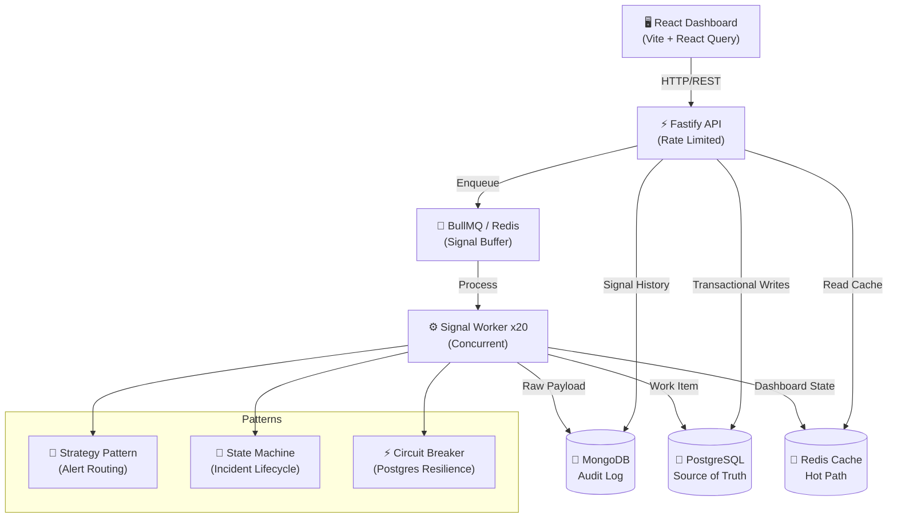

# 🚨 IMS — Incident Management System

> A production-grade, real-time incident management platform built for distributed systems monitoring and response.


---

## Architecture



## Tech Stack

| Technology | Role | Why |
|-----------|------|-----|
| **Node.js 20** | Runtime | LTS with native ESM, top-level await, and excellent TypeScript support |
| **TypeScript** | Language | Strict mode catches bugs at compile time; Zod for runtime validation |
| **Fastify v4** | HTTP Framework | 2-3x faster than Express; built-in schema validation and logging |
| **BullMQ** | Message Queue | Redis-backed job queue with concurrency control, retries, and backpressure |
| **PostgreSQL** | RDBMS | ACID transactions for WorkItem source of truth; Prisma ORM for type safety |
| **MongoDB** | NoSQL | Schema-flexible audit log for raw signal payloads; Mongoose ODM |
| **Redis** | Cache/Queue | Sub-ms reads for dashboard hot path; BullMQ backing store; debounce keys |
| **React 18** | Frontend | Component model, Suspense, concurrent features |
| **Vite** | Bundler | Instant HMR, native ESM dev server |
| **React Query** | Data Fetching | Auto-refetch, cache invalidation, optimistic updates |
| **Recharts** | Charts | Composable chart components built on D3 |
| **Framer Motion** | Animations | Physics-based animations for polished UI |

## Project Structure

```
/ims
├── backend/                 → Node.js (TypeScript) + Fastify
│   ├── prisma/
│   │   └── schema.prisma   → PostgreSQL schema (WorkItem, RCA, Signal)
│   └── src/
│       ├── config/          → Database connections (Postgres, Mongo, Redis)
│       ├── models/          → Mongoose schemas (RawSignal)
│       ├── queues/          → BullMQ queue configuration
│       ├── routes/          → API endpoints (signals, workitems, dashboard, health)
│       ├── schemas/         → Zod validation schemas
│       ├── state/           → WorkItem state machine
│       ├── strategies/      → Alert strategy pattern
│       ├── utils/           → Retry, circuit breaker
│       ├── workers/         → BullMQ signal worker
│       ├── observability/   → Throughput logger
│       ├── __tests__/       → Vitest unit tests
│       └── server.ts        → Entry point
├── frontend/                → React 18 + Vite + TypeScript
│   └── src/
│       ├── components/      → Layout, Dashboard, Incidents, RCA components
│       ├── hooks/           → React Query hooks
│       ├── lib/             → API client, utilities
│       └── pages/           → Dashboard, IncidentDetail, Incidents, Simulate
├── scripts/
│   ├── seed.ts              → Database seed script
│   └── simulate-failure.ts  → Cascading failure simulation
├── docs/
│   └── PROMPTS.md           → All prompts used during development
├── docker-compose.yml       → Full infrastructure stack
├── .env.example             → Environment variable template
└── README.md                → This file
```

## Setup Instructions

### Prerequisites

- **Docker** & Docker Compose (v2+)
- **Node.js 20** (LTS)
- **npm** (v9+)

### Quick Start

```bash
# 1. Clone and install
git clone <repo-url> && cd ims
cd backend && npm install
cd ../frontend && npm install
cd ..

# 2. Environment
cp .env.example .env

# 3. Start infrastructure (Postgres, MongoDB, Redis)
docker-compose up -d postgres mongodb redis

# 4. Run Prisma migrations
cd backend && npx prisma migrate dev --name init

# 5. Seed sample data
npx tsx ../scripts/seed.ts

# 6. Start backend (terminal 1)
npm run dev

# 7. Start frontend (terminal 2)
cd ../frontend && npm run dev

# 8. Open dashboard
# http://localhost:5173
```

### Running Simulation

```bash
# In a separate terminal, with backend running:
cd scripts
npx tsx simulate-failure.ts
```

## How I Handled Backpressure

BullMQ serves as the critical buffer between HTTP signal ingestion and database writes. When monitoring agents emit thousands of signals per second during an outage, the API accepts them immediately (HTTP 202) and enqueues them — never blocking on database I/O inside the request handler.

The BullMQ worker processes signals with a concurrency of 20, providing natural rate limiting. Each worker performs a MongoDB write (fire-and-forget with retry) and a Postgres transaction (with circuit breaker protection). This decoupling prevents database overload during signal bursts.

A queue depth monitor runs every 2 seconds. If the queue exceeds 50,000 pending jobs, it triggers a **pause** — temporarily halting new job acceptance to let workers drain the backlog. Once the depth drops below 10,000, ingestion resumes automatically. This feedback loop prevents unbounded memory growth.

Signal throughput is measured using a **Redis sliding window counter** — `INCR` with a 5-second `EXPIRE`. The throughput logger reads this every 5 seconds and emits `[THROUGHPUT] Signals/sec: X | Queue depth: Y | Active workers: Z` for operational visibility.

## Design Patterns

| Pattern | Where Used | Why |
|---------|-----------|-----|
| **Strategy** | `AlertStrategy.ts` | Each component type (RDBMS, API, Cache) maps to a different alert priority and notification channel. New types can be added without modifying existing code. |
| **State Machine** | `WorkItemStateMachine.ts` | Enforces valid lifecycle transitions (OPEN → INVESTIGATING → RESOLVED → CLOSED). Prevents invalid skips and validates RCA completeness before CLOSED. |
| **Factory** | `AlertStrategyFactory` | Decouples alert strategy creation from signal processing. The worker doesn't need to know which strategy to use — the factory decides. |
| **Circuit Breaker** | `circuitBreaker.ts` | If PostgreSQL fails 5 consecutive times, the circuit opens for 30s, preventing cascading failures and giving the DB time to recover. |
| **Repository** | Prisma Client | Abstracts database operations behind a typed ORM, making it easy to test and swap implementations. |

## API Reference

### `POST /api/signals`
Ingest a monitoring signal.
```bash
curl -X POST http://localhost:3001/api/signals \
  -H "Content-Type: application/json" \
  -d '{"componentId":"RDBMS_PRIMARY","componentType":"RDBMS","errorCode":"CONN_TIMEOUT","latencyMs":3500,"payload":{}}'
# → 202 Accepted
```

### `GET /api/workitems`
List work items with pagination and filters.
```bash
curl "http://localhost:3001/api/workitems?status=OPEN&priority=P0&page=1&limit=10"
```

### `GET /api/workitems/:id`
Get work item detail with linked signals.
```bash
curl http://localhost:3001/api/workitems/<uuid>
```

### `PUT /api/workitems/:id/status`
Transition work item status.
```bash
curl -X PUT http://localhost:3001/api/workitems/<uuid>/status \
  -H "Content-Type: application/json" \
  -d '{"status":"INVESTIGATING"}'
```

### `POST /api/workitems/:id/rca`
Submit Root Cause Analysis.
```bash
curl -X POST http://localhost:3001/api/workitems/<uuid>/rca \
  -H "Content-Type: application/json" \
  -d '{
    "startTime":"2024-01-15T10:00:00Z",
    "endTime":"2024-01-15T12:30:00Z",
    "rootCauseCategory":"Infrastructure",
    "fixApplied":"Increased connection pool max from 100 to 200 and restarted affected services",
    "preventionSteps":"Added connection pool monitoring alerts and circuit breaker to prevent cascade"
  }'
```

### `GET /api/dashboard/stats`
Get aggregated dashboard statistics.
```bash
curl http://localhost:3001/api/dashboard/stats
# → {"total":10,"byStatus":{"OPEN":3,"INVESTIGATING":2,...},"avgMttr":5400,...}
```

### `GET /health`
System health check.
```bash
curl http://localhost:3001/health
# → {"status":"ok","uptime":3600,"services":{"postgres":"connected",...},"queue":{...}}
```

## Testing

```bash
cd backend
npx vitest run
```

Tests cover:
- **RCA Validation**: Field completeness, character minimums, MTTR calculation, datetime ordering
- **State Machine**: Valid transitions, invalid skips, RCA requirement for CLOSED
- **Debounce Logic**: Signal deduplication within TTL, new creation after expiry
- **Alert Strategy**: Component type → priority mapping, notification channel assignment

## License

MIT
