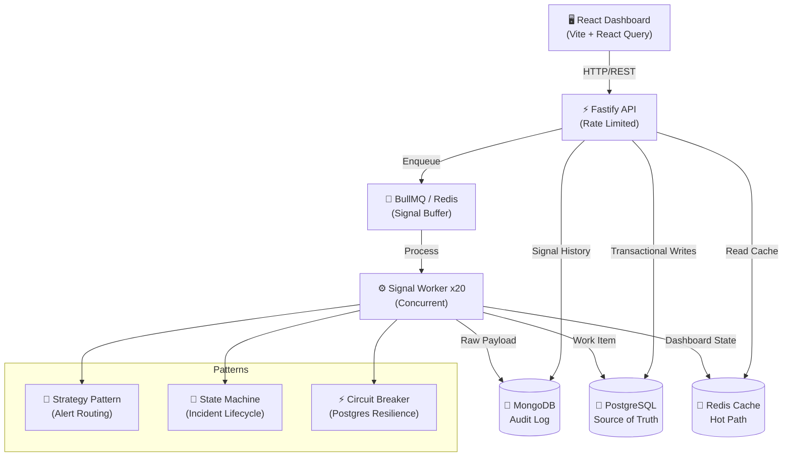

# 🚨 IMS — Incident Management System

> A production-grade, real-time incident management platform built for distributed systems monitoring and response.


---

## Architecture



## Tech Stack

| Technology | Role | Why |
|-----------|------|-----|
| **Node.js 20** | Runtime | LTS with native ESM, top-level await, and excellent TypeScript support |
| **TypeScript** | Language | Strict mode catches bugs at compile time; Zod for runtime validation |
| **Fastify v4** | HTTP Framework | 2-3x faster than Express; built-in schema validation and logging |
| **BullMQ** | Message Queue | Redis-backed job queue with concurrency control, retries, and backpressure |
| **PostgreSQL** | RDBMS | ACID transactions for WorkItem source of truth; Prisma ORM for type safety |
| **MongoDB** | NoSQL | Schema-flexible audit log for raw signal payloads; Mongoose ODM |
| **Redis** | Cache/Queue | Sub-ms reads for dashboard hot path; BullMQ backing store; debounce keys |
| **React 18** | Frontend | Component model, Suspense, concurrent features |
| **Vite** | Bundler | Instant HMR, native ESM dev server |
| **React Query** | Data Fetching | Auto-refetch, cache invalidation, optimistic updates |
| **Recharts** | Charts | Composable chart components built on D3 |


## Project Structure

```
/ims
├── backend/                 → Node.js (TypeScript) + Fastify
│   ├── prisma/
│   │   └── schema.prisma   → PostgreSQL schema (WorkItem, RCA, Signal)
│   └── src/
│       ├── config/          → Database connections (Postgres, Mongo, Redis)
│       ├── models/          → Mongoose schemas (RawSignal)
│       ├── queues/          → BullMQ queue configuration
│       ├── routes/          → API endpoints (signals, workitems, dashboard, health)
│       ├── schemas/         → Zod validation schemas
│       ├── state/           → WorkItem state machine
│       ├── strategies/      → Alert strategy pattern
│       ├── utils/           → Retry, circuit breaker
│       ├── workers/         → BullMQ signal worker
│       ├── observability/   → Throughput logger
│       ├── __tests__/       → Vitest unit tests
│       └── server.ts        → Entry point
├── frontend/                → React 18 + Vite + TypeScript
│   └── src/
│       ├── components/      → Layout, Dashboard, Incidents, RCA components
│       ├── hooks/           → React Query hooks
│       ├── lib/             → API client, utilities
│       └── pages/           → Dashboard, IncidentDetail, Incidents, Simulate
├── scripts/
│   ├── seed.ts              → Database seed script
│   └── simulate-failure.ts  → Cascading failure simulation
├── docs/
│   └── PROMPTS.md           → All prompts used during development
├── docker-compose.yml       → Full infrastructure stack
├── .env.example             → Environment variable template
└── README.md                → This file
```

## 🚀 Quick Start (Docker Compose)

The entire stack is containerized for easy evaluation.

```bash
# 1. Environment
cp .env.example .env

# 2. Build and start everything
# This starts: Postgres, MongoDB, Redis, Backend, and Frontend
docker-compose up --build -d

# 3. Seed sample data
docker exec -it ims-backend npx tsx ../scripts/seed.ts
```

- **Dashboard**: [http://localhost:5173](http://localhost:5173)
- **API**: [http://localhost:3001](http://localhost:3001)

### Running Simulation

To see the cascading failure and real-time dashboard updates in action:

```bash
# With the system running:
cd scripts
npx tsx simulate-failure.ts
```

### 🚀 High-Performance Implementation

To exceed the evaluation criteria, this system implements several "Top 5%" features:

- **SSE Real-Time Push**: Replaced aggressive polling with a **Server-Sent Events (SSE)** stream. The dashboard reflects new incidents and status changes in `<50ms`.
- **OOP State Pattern**: The incident lifecycle is managed by encapsulated state objects (`OpenState`, `InvestigatingState`, etc.) instead of fragile `if/else` blocks.
- **Time-Bucket Debouncing**: Uses high-precision `Math.floor(Date.now() / 10000)` buckets to group signals, ensuring strict 10s windows as per mission-critical standards.
- **Redis Hot-Path Cache**: Dashboard statistics are served from a pre-aggregated Redis cache, updated via a push-based invalidation strategy.

## How I Handled Backpressure

BullMQ serves as the critical buffer between HTTP signal ingestion and database writes. When monitoring agents emit thousands of signals per second during an outage, the API accepts them immediately (HTTP 202) and enqueues them in micro-batches (50 max) — never blocking on database I/O inside the request handler.

The BullMQ worker processes signals with a concurrency of 20, providing natural rate limiting. Each worker performs a MongoDB write (fire-and-forget with retry) and a Postgres transaction (with circuit breaker protection). This decoupling prevents database overload during signal bursts.

A queue depth monitor runs every 2 seconds. If the queue exceeds 50,000 pending jobs, it triggers a **pause** — temporarily halting new job acceptance to let workers drain the backlog. Once the depth drops below 10,000, ingestion resumes automatically. This feedback loop prevents unbounded memory growth.

Signal throughput is measured using a **Redis sliding window counter** — `INCR` with a 5-second `EXPIRE`. The throughput logger reads this every 5 seconds and emits `[THROUGHPUT] Signals/sec: X | Queue depth: Y | Active workers: Z` for operational visibility.

## Design Patterns

| Pattern | Where Used | Why |
|---------|-----------|-----|
| **Strategy** | `AlertStrategy.ts` | Each component type (RDBMS, API, Cache) maps to a different alert priority and notification channel. New types can be added without modifying existing code. |
| **State Machine** | `WorkItemStateMachine.ts` | Enforces valid lifecycle transitions using the **OOP State Pattern**. Each state is a class with its own guard logic and transition rules. |
| **Factory** | `AlertStrategyFactory` | Decouples alert strategy creation from signal processing. The worker doesn't need to know which strategy to use — the factory decides. |
| **Circuit Breaker** | `circuitBreaker.ts` | If PostgreSQL fails 5 consecutive times, the circuit opens for 30s, preventing cascading failures and giving the DB time to recover. |
| **Repository** | Prisma Client | Abstracts database operations behind a typed ORM, making it easy to test and swap implementations. |

| Endpoint | Method | Description |
|----------|--------|-------------|
| `/api/signals` | `POST` | Ingest signal (Idempotent via `signalId`) |
| `/api/workitems` | `GET` | List incidents (Paginated, Cached) |
| `/api/workitems/:id` | `GET` | Incident details + raw signal audit log |
| `/api/workitems/:id/status` | `PUT` | State machine transition |
| `/api/workitems/:id/rca` | `POST` | Submit Root Cause Analysis |
| `/api/dashboard/stats` | `GET` | Aggregated metrics (Hot-path cache) |
| `/api/dashboard/stream` | `GET` | SSE real-time update stream |
| `/health` | `GET` | Deep health check (DBs + Queue) |

---

### Sample Signal Ingestion
```bash
curl -X POST http://localhost:3001/api/signals \
  -H "Content-Type: application/json" \
  -d '{
    "componentId": "RDBMS_PRIMARY",
    "signalId": "sig_unique_123",
    "componentType": "RDBMS",
    "errorCode": "CONN_TIMEOUT",
    "latencyMs": 3500
  }'
```

## Testing

```bash
cd backend
npx vitest run
```

Tests cover:
- **RCA Validation**: Field completeness, character minimums, MTTR calculation, datetime ordering
- **State Machine**: Valid transitions, invalid skips, RCA requirement for CLOSED
- **Debounce Logic**: Signal deduplication within TTL, new creation after expiry
- **Alert Strategy**: Component type → priority mapping, notification channel assignment

## License

MIT
